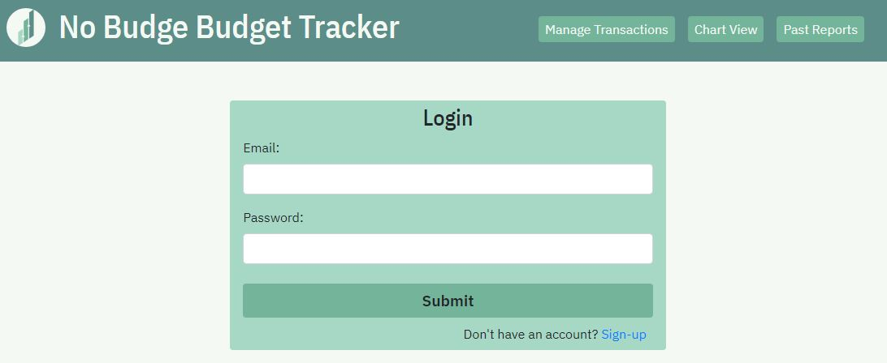
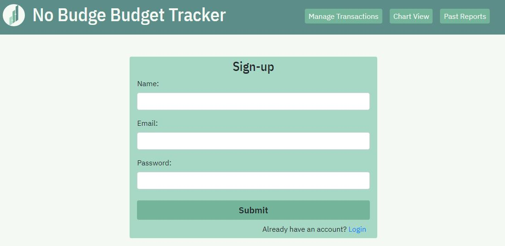
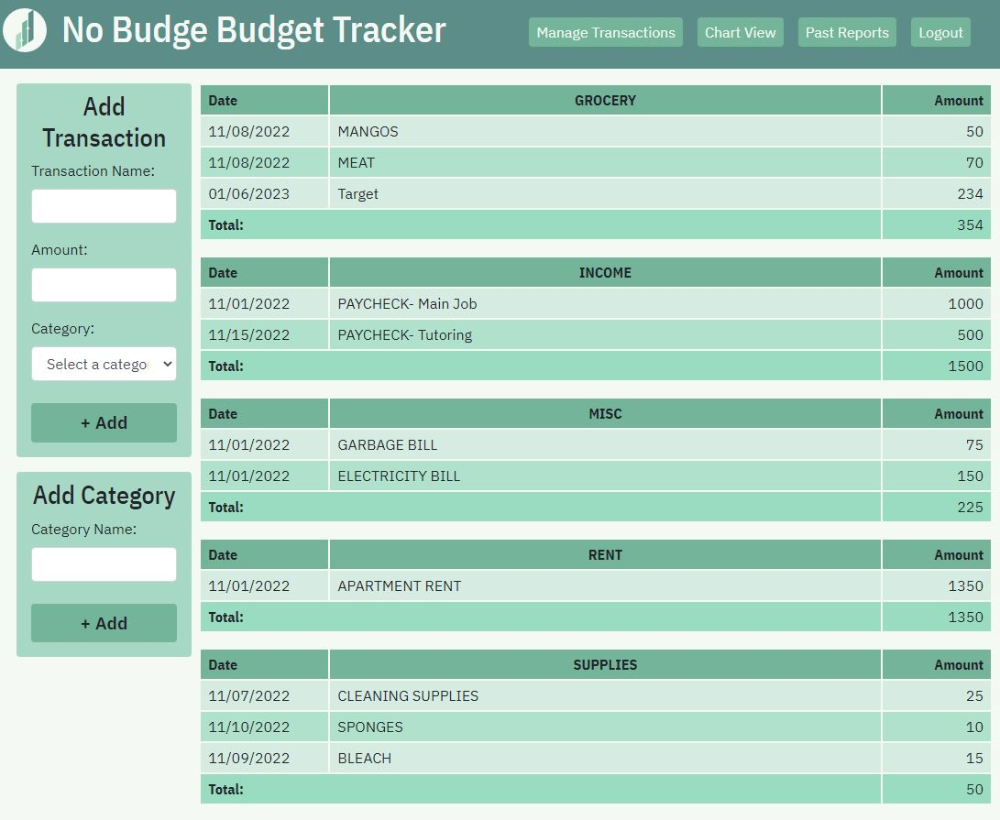

# No-Budge-Budget-Tracker
    
## Description
A full stack application that takes in user data and helps them keep track of their monthly income and expenses to set personal finance goals.

## Table Of Contents 
- [Installation](#installation)
- [Usage](#usage)
- [License](#license)
- [Contributing](#contributing)
- [Tests](#tests)
- [Questions](#questions)

## Installation
Git clone this repo. 
Install the dependencies with `npm install`.

## Usage
[Deployed Site](https://no-budge.herokuapp.com/chart-view) 
Either create an account or if you have done so already, login to your account. On the left hand side, add a name for your transaction, the amount of the transaction and select a category. You can also add your own custom category (or see ones others have created) to customize your budget tracking for your needs. Once you have added your transaction, it will appear on the right side under the category you have selected. The break-down of your spending in a doughnut style chart can be found by clicking the 'Chart View' button in the header. This will give you a great visual to see where you're spending the most or spending the least in your categories. Another way to keep track of your budget is by reflecting on your previous spending to compare where you were to where you are now, you can do this by clicking the 'Past Reports' button in the header. Always stay on top of your spending, set goals and have a streamlined way to do that by using No Budget Budget Tracker. 
 
Login: 
 
 
Sign-up: 
 
 
Manage Transactions: 
 
 
Chart View: 

## License
This project is covered under the MIT license. Please refer to this link to read the license, permissions, conditions and limitations:
[License: MIT](https://choosealicense.com/licenses/mit/)

## Contributing
➡️[Grant Gorosave Github](https://github.com/ggorosave) 
➡️[Grant Gorosave Portfolio](grantgorosave.com) 
➡️[Eduardo Arellano Github](https://github.com/arellanoe) 
➡️[Isabella Pettini Github](https://github.com/isabella-pettini) 

## Tests
N/A

## Questions
Please reach us by our GitHub links above or by email below with any additional questions about this project.  
➡️[Grant Gorosave](mailto:ggorosave@gmail.com) 
➡️[Eduardo Arellano](mailto:arellanoeduardo05@gmail.com) 
➡️[Isabella Pettini](mailto:isabellapierce93@gmail.com) 